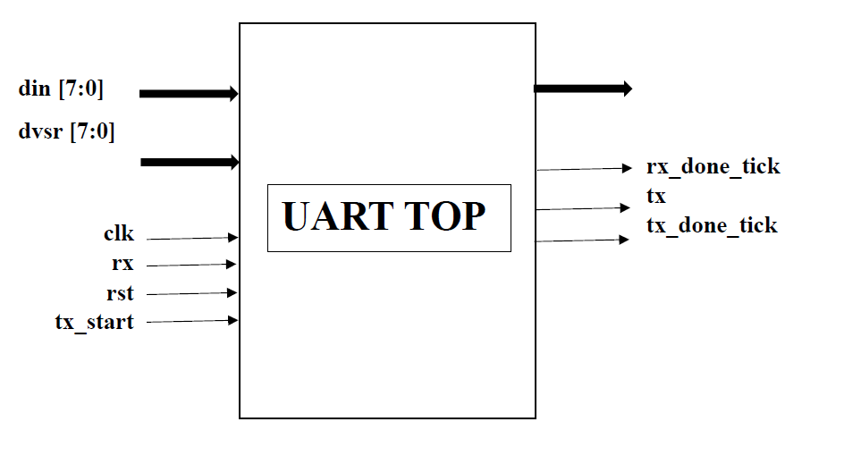
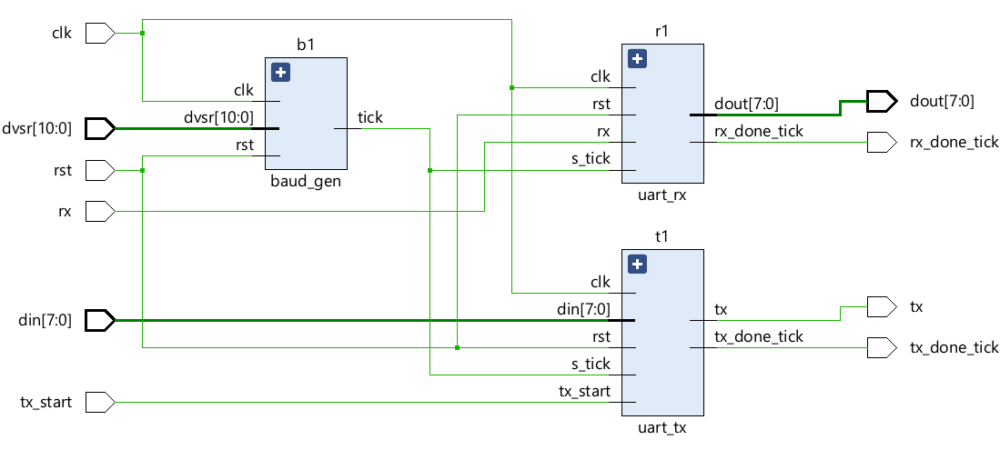
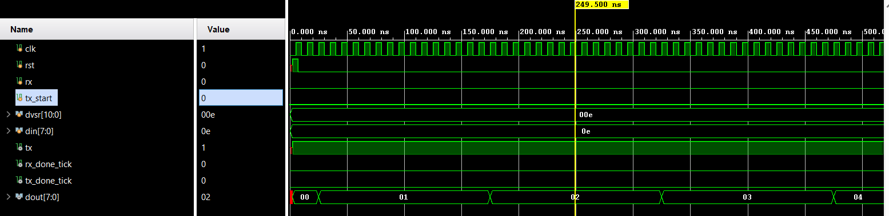

# UART

 
# UART Communication Modules 
This project implements a complete UART communication system in Verilog, including UART Receiver, UART Transmitter, and Baud Rate Generator modules. The design follows a clean FSM-based approach and supports standard UART framing with 8 data bits and 16× oversampling for reliable asynchronous communication.

# 📌 Overview

The UART system consists of three core components:

uart_rx – Receives serial data and outputs an 8-bit parallel word.
uart_tx – Converts an 8-bit parallel word into serial UART format.
baud_gen – Generates timing ticks based on a configurable clock divisor.

The modules integrate to form a fully functional serial communication interface suitable for FPGA-based embedded systems.

# 📡 UART Receiver (uart_rx)

The receiver detects and reconstructs incoming serial data frames using a four-state FSM:

IDLE – Waits for a falling edge indicating the start bit.

START – Samples at mid-bit to confirm start bit validity.

DATA – Samples 8 data bits using 16× oversampling; captures LSB first.

STOP – Verifies the stop bit and signals data reception complete.

The output byte becomes available on the dout bus and rx_done_tick is asserted once a full frame is received.

# 📤 UART Transmitter (uart_tx)

The transmitter serializes 8-bit parallel data following standard UART framing:

IDLE – Line remains high; waits for tx_start.

START – Drives a start bit (0).
DATA – Shifts out 8 data bits (LSB first).
STOP – Sends one stop bit (1) before completing the transmission.

A transmission-complete pulse is provided through tx_done_tick.

# ⏱ Baud Rate Generator (baud_gen)

The baud generator divides the system clock using the programmable divisor dvsr to create a tick used for bit timing and oversampling.

It provides a single-cycle pulse (tick) at the required oversampling frequency (typically 16× baud).

# 🔧 Parameters
Module	Parameter	Description

uart_rx	DBIT	Number of data bits (default: 8)

uart_rx	SB_TICK	Oversampled stop-bit length (16 ticks)

uart_tx	DBIT	Number of data bits (default: 8)

uart_tx	SB_TICK	Oversampled stop-bit duration

baud_gen	dvsr	Clock divisor for baud tick generation

```
📁 File Structure
├── uart_rx.v
├── uart_tx.v
├── baud_gen.v
└── README.md
```
# 🚀 Usage

Instantiate baud_gen with appropriate divisor for your system clock and desired baud rate.

Connect its tick output to both uart_rx and uart_tx as s_tick.

Use tx_start and din to send data.

Listen to rx_done_tick and dout to receive data.


This modular structure makes the design portable and easy to integrate into any FPGA project.

# RTL Schematic


# Simulation



